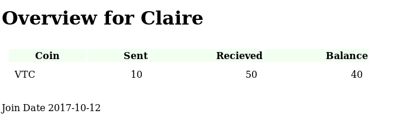
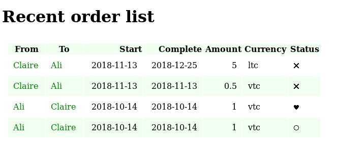

# RedditTipBot Web Monitor

NodeJS/Pug webapp to monitor RedditTipBot.

#### Screenshots




# Technical description

Pulls orders from orderbook.

Displays webpage to show orders.

## Dependencies

* NodeJS
- Pug
- MongoDB
- Maki - images only Licensed under CC0

### Running

While running RTB

```
$ npm install
$ node app.js
```

### Databases

User
{"name": "Claire",
"coins": [{"name": "VTC","sent": 10,"recieved": 50,"balance": 40}],
"joindate": "2017-10-12"}

Orders
{'from': "Claire",
"to": "Ali",
"amount": 0.5,
"coin": "vtc",
"startdate": "2018-11-13",
"enddate": "2018-11-13",
"status": -1}